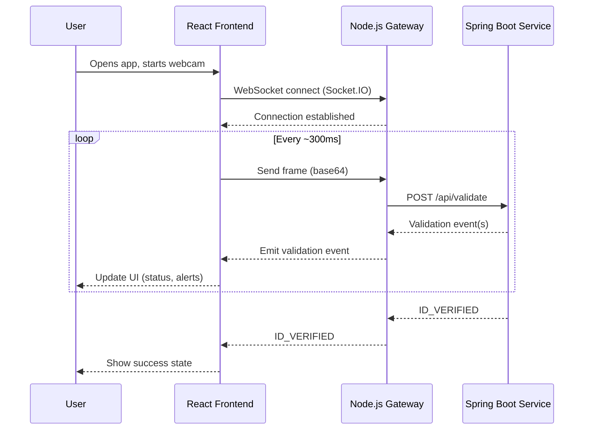

# Sequence Diagram

## Frame Validation Flow

## Event Types

- `GLARE_DETECTED` — glare on document; user should adjust lighting
- `FACE_NOT_VISIBLE` — face not detected in frame
- `DOCUMENT_OUT_OF_FRAME` — ID document not fully visible
- `DOCUMENT_CENTERED` — document positioned correctly
- `ID_VERIFIED` — verification complete
